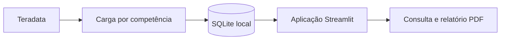

# Sistema de consulta de beneficiários BPC

> **Versão de portfólio:** nomes de bases e tabelas, caminhos e cabeçalhos institucionais foram substituídos por exemplos. As consultas ilustram a implementação e precisam de adaptação a fontes autorizadas. Não há dados reais incluídos.

Aplicação em Python e Streamlit para consultar pessoas, benefícios e grupos familiares a partir de uma base SQLite organizada por referência mensal.

O objetivo é disponibilizar uma interface de consulta sobre dados previamente preparados, separando a rotina de pesquisa do processamento e da transferência de dados do Teradata.

## O que a solução entrega

- Pesquisa por CPF ou número de benefício.
- Consulta de grupo familiar e referências disponíveis.
- Visão inicial com métricas da base local.
- Login, administração de usuários e troca de senha.
- Registro de consultas e geração de relatórios em PDF.
- Scripts para carga, atualização, manutenção de índices e métricas.

As telas presentes nesta versão são início, consulta de pessoa, consulta de grupo familiar e administração. Há SQL de apoio a monitoramento de denúncias, mas não há uma página correspondente implementada nesta árvore.

## Arquitetura

A aplicação consulta a cópia local; a atualização é uma operação separada. Isso reduz a dependência da origem durante as pesquisas, mas significa que a atualidade da informação depende da última carga concluída.

## Decisões técnicas

| Decisão implementada | Papel na solução | Limite ou compromisso |
| --- | --- | --- |
| SQLite para consulta local | Dispensa um servidor de banco separado para a aplicação | Exige espaço em disco e cuidado com concorrência de escrita |
| Streamlit para interface | Mantém interface e tratamento de dados em Python | A navegação depende do modelo de execução do Streamlit |
| Cargas por competência, lotes e checkpoints | Organiza histórico e permite retomada de processamento | Reprocessamentos dependem da configuração e do estado da carga |
| Índices e rotinas de manutenção separados | Permite ajustar o custo de carga e consulta | A manutenção precisa ser acompanhada operacionalmente |
| Configuração por ambiente | Separa parâmetros locais do código | Credenciais e permissões são requisitos externos |

Essas escolhas são descritas a partir da implementação disponível; não representam um histórico datado de decisões.

## Tecnologias e competências demonstradas

**Python, Streamlit, SQLite, Teradata, Pandas, python-dotenv e ReportLab.**

O projeto reúne modelagem para consulta, integração entre bancos, controle de acesso, geração de documentos e tratamento de falhas de carga. A implementação de senhas utiliza PBKDF2-HMAC; isso é um componente do controle de acesso, não uma certificação de segurança da aplicação.

## Organização

O código está em [consulta-beneficiario-mvp](consulta-beneficiario-mvp/README.md):

- `app/`: telas, autenticação, serviços e utilitários.
- `scripts/`: carga e manutenção da base local.
- `sql/`: estruturas e consultas de apoio.
- `tests/`: testes de conexão e rotinas de carga/manutenção.
- `requirements/`: dependências separadas por finalidade.
- `docs/`: documentação técnica complementar.

## Execução e limites

Consulte o [guia da aplicação](consulta-beneficiario-mvp/README.md) para instalação e comandos. É necessário preparar um SQLite compatível ou configurar acesso autorizado à origem.

Não há base sintética pronta incluída. Bases de beneficiários, logs de consulta e PDFs podem conter dados pessoais e devem permanecer fora do repositório.

**Portfólio:** [Gnolian](https://github.com/Gnolian).
