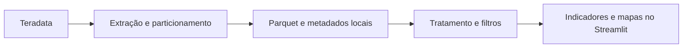

# Painel de benefícios assistenciais

> **Versão de portfólio:** nomes de bases e tabelas, caminhos e cabeçalhos institucionais foram substituídos por exemplos. As consultas ilustram a implementação e precisam de adaptação a fontes autorizadas. Não há dados reais incluídos.

Painel em Streamlit para explorar informações da folha de pagamento, do Cadastro Único e de campanhas cadastrais, com recortes demográficos e territoriais.

O objetivo é transformar bases preparadas no Teradata em uma experiência de análise com filtros, indicadores, gráficos e mapas, reutilizando arquivos locais em vez de repetir a extração a cada interação.

## O que pode ser analisado

- BPC na folha de pagamento.
- Informações do Cadastro Único.
- Campanhas de revisão cadastral.
- Auxílio-Inclusão e benefícios relacionados a Zika.
- Distribuição por UF e município.

As páginas usam campos e grupos definidos nas bases de origem. Elas dependem desses esquemas; não são conectores genéricos para qualquer planilha.

## Fluxo de dados



## Decisões técnicas

| Escolha | Objetivo | Compromisso |
| --- | --- | --- |
| Separar folha, cadastro, revisão e mapas | Respeitar diferentes granularidades e reduzir mistura de contagens | Exige preparar os conjuntos esperados |
| Parquet como armazenamento intermediário | Reutilizar a extração e permitir leitura de colunas selecionadas | Requer atualização explícita do cache |
| Particionamento por UF, com divisão adicional configurável | Organizar extrações maiores em partes menores | Não elimina toda a consolidação em memória |
| Cache do Streamlit | Reaproveitar leituras entre interações | Atualização dos arquivos e cache precisa ser coordenada |
| Contagem de benefícios únicos nos resumos | Evitar tratar linhas repetidas como novos benefícios | Depende da qualidade da chave de benefício |

## Tecnologias

Python, Streamlit, Pandas, Plotly, Teradata e python-dotenv. Parquet requer um mecanismo de leitura/escrita, como PyArrow. A exportação para Excel também depende da biblioteca usada pelo exportador.

## Organização do código

- [app.py](app.py): entrada do painel.
- [pages](pages): sete páginas temáticas.
- [src/config.py](src/config.py): fontes, diretórios e parâmetros de particionamento.
- [src/database.py](src/database.py): acesso à origem.
- [src/loaders.py](src/loaders.py): leitura de Parquet e metadados.
- [src/transforms.py](src/transforms.py): preparação, filtros e agregações.
- [src/visuals.py](src/visuals.py): componentes visuais.
- [export_parquet_ufs.py](export_parquet_ufs.py): preparação das bases locais.
- [export_excel.py](export_excel.py): exportação auxiliar que espera especificamente `outputs/perfil_full.parquet`; não consome diretamente a estrutura atual de folha e cadastro.

## Execução

A partir desta pasta, em um ambiente Python 3.10 ou superior:

```powershell
python -m pip install -r requirements.txt
python -m pip install pyarrow openpyxl
```

Configure localmente `TD_HOST`, `TD_USER`, `TD_PASSWORD` e, conforme a origem, `TD_LOGMECH`, `TD_DATABASE` e as variáveis `TD_TABLE_*` de [src/config.py](src/config.py). O arquivo `.env` é lido com python-dotenv.

Para preparar as bases em um ambiente com acesso autorizado e depois abrir o painel:

```powershell
python export_parquet_ufs.py
python -m streamlit run app.py
```

As páginas esperam os Parquets e metadados na estrutura configurada em `outputs/`. Abrir a interface sem essas bases não constitui uma demonstração funcional. O exportador inicia com `only_missing=True`: arquivos existentes podem ser reaproveitados, portanto uma execução não implica atualização integral da base.

## O que este projeto demonstra

Organização de uma aplicação analítica em camadas, uso de armazenamento colunar, tratamento de granularidade, filtros combinados e visualização geográfica. Não há benchmark incluído para quantificar ganhos de desempenho.

Os arquivos locais podem conter identificadores pessoais. Para apresentação pública, utilize bases sintéticas compatíveis; não publique extrações nem capturas com registros reais.
